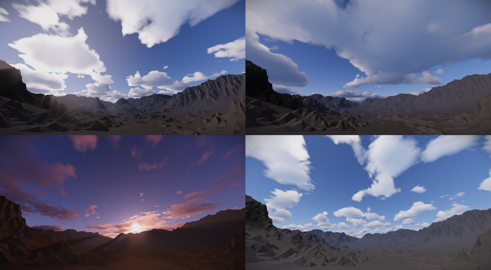
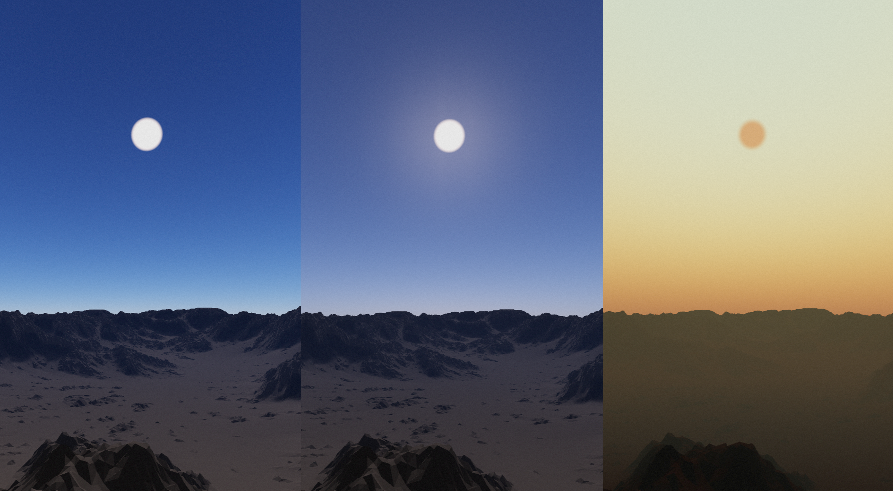
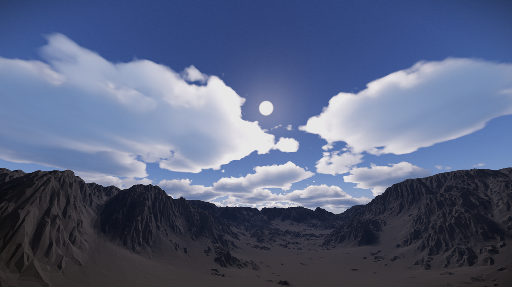
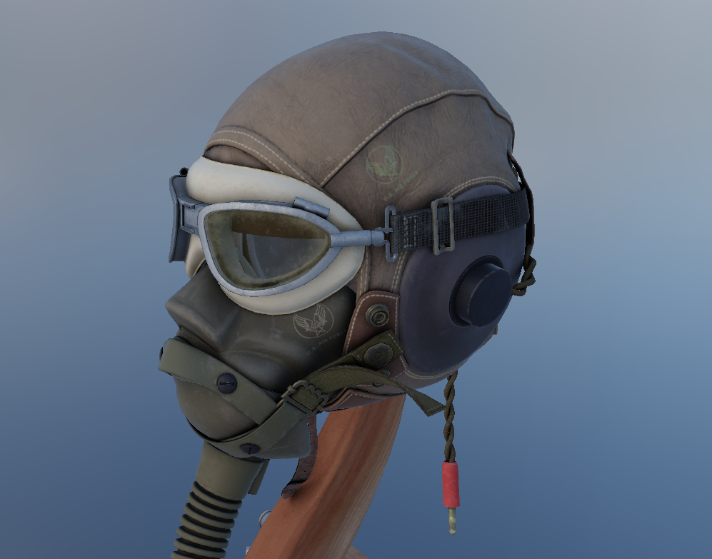
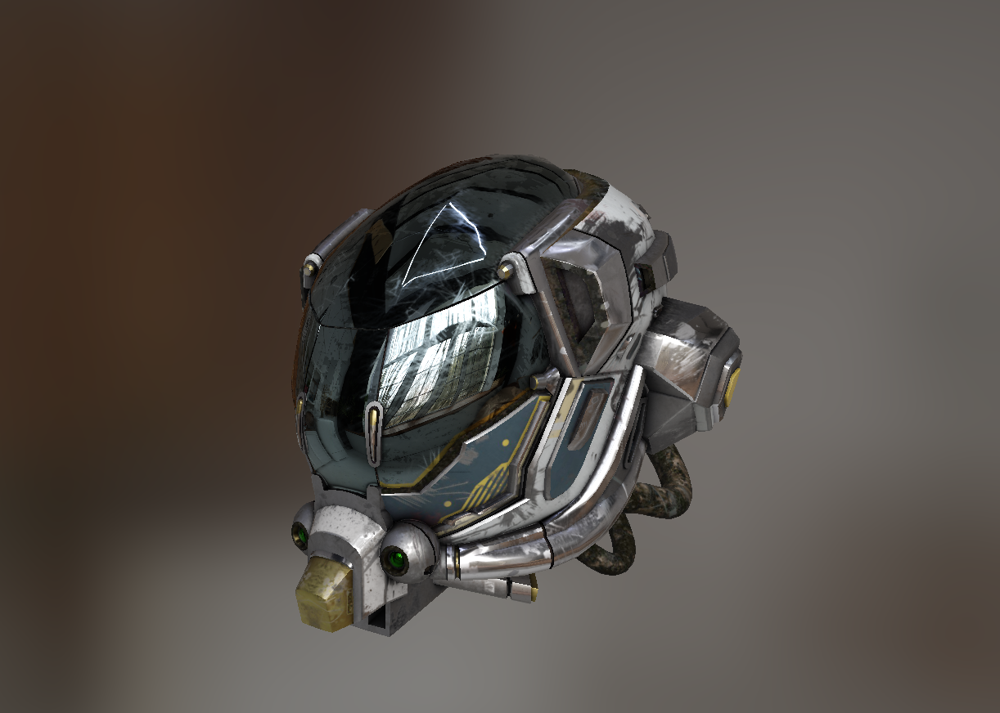
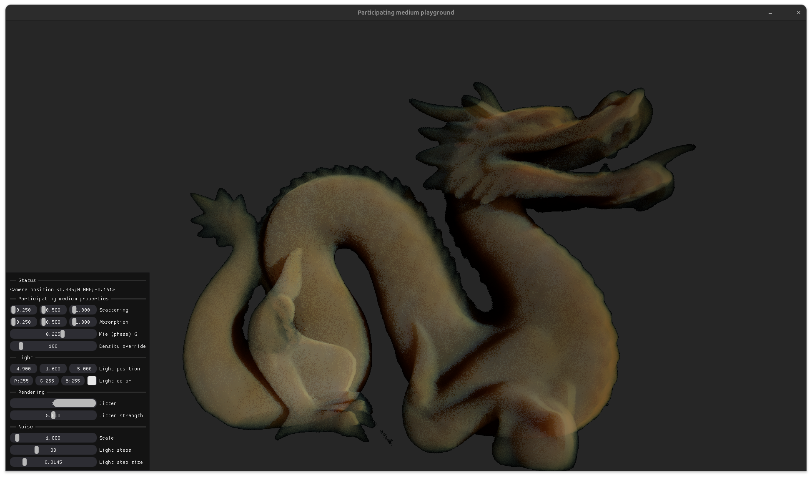

# Hammock - modern Vulkan renderer
Hammock is lightweight Vulkan render with modern features and moder code.

**Notice:** The renderer is being rewritten in this branch. During tha last few projects, I noticed many obstacles in
the renderer design. The renderer being built here, is gonna be very different than in master branch.

# New (planed) features
- C++ 23 language standard
- Modular architecture
- Customizable rendering pipeline 
- Dependency graph based rendering 
- State-of-the-art graphics
- And much more

## Old Hammock pics

About licencing: [https://choosealicense.com/no-permission/](https://choosealicense.com/no-permission/)

